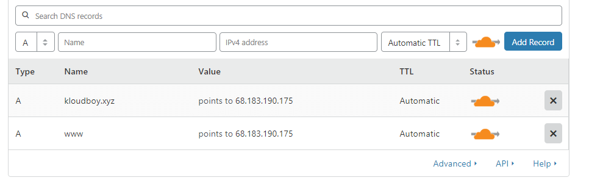
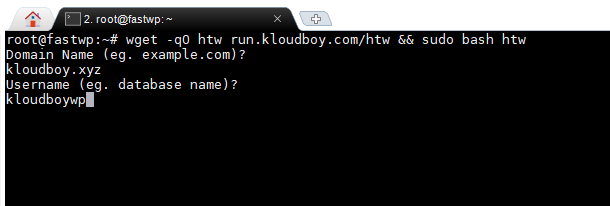
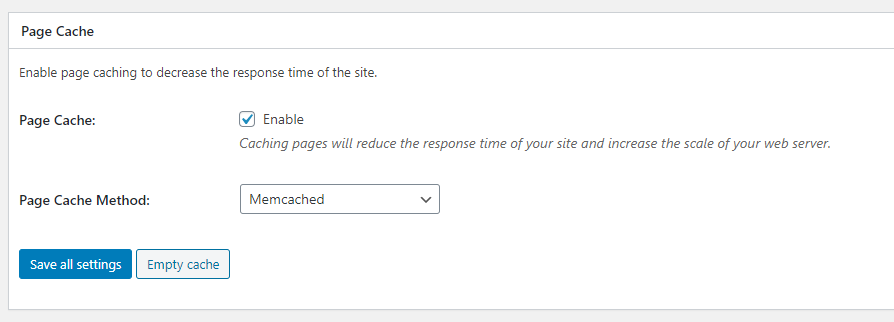
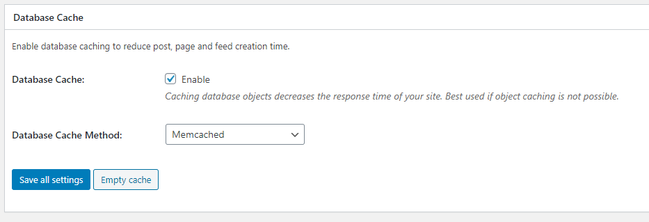
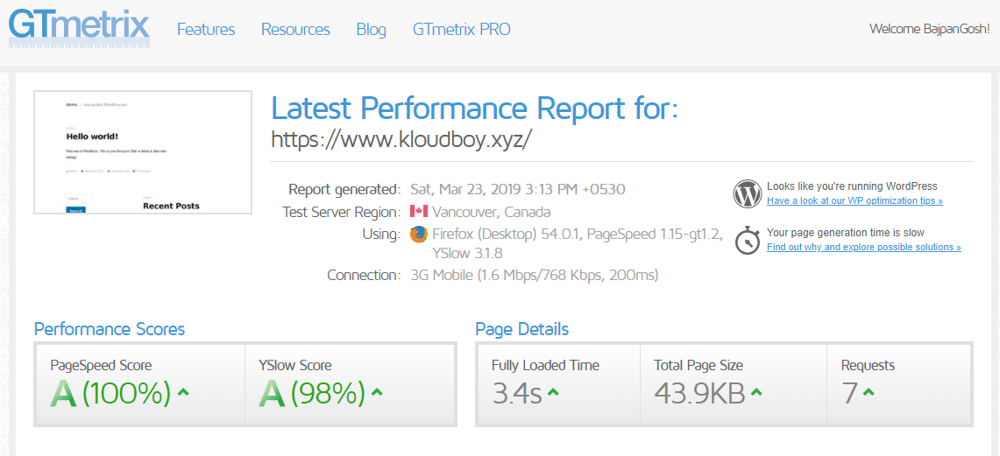

# High Traffic wordpress server configuration
> This LEMP stack is that fastest way to start running WordPress on your server. Using Nginx, PHP 7.4, Mariadb.


## Installation & Usage

## (1st Step) CloudFlare settings

Add your droplet(vps) ip address to CloudFlare A record.



## (2nd Step) Login to ssh console

run below script. it'll ask your domain name just add "yoursite.com" format next your database name add "examplewp"



###### Ubuntu-18.04 and Ubuntu-20.04 Support.

Linux Only:

```sh
wget -qO htw run.kloudboy.com/htw && sudo bash htw
```

## Features

> Nginx (Lastest)

> PHP 7.4

> PHP-fpm

> Mariadb (Lastest)

> Wordpress (Lastest)

> WP-CLI (Lastest)

> Memcached (Lastest)

> Cloudflare Full SSL

## Recommended CloudFlare Page Rules for WordPress Sites

[Page Rules 1](https://community.cloudflare.com/t/recommended-cloudflare-page-rules-for-wordpress-sites/12502)

## Caching Static HTML with WordPress/WooCommerce
[Page Rules 2](https://support.cloudflare.com/hc/en-us/articles/236166048-Caching-Static-HTML-with-WordPress-WooCommerce)

## Activate Memcached

>Install W3 Total Cache and Activate

In the main menu, go to Performance then click on General Settings
###### Activate Memcached for the following options:

Page Cache Method


Database cache method


Save the settings

## Gtmetrix Performance Report



## Try DigitalOcean for Free with a $100 Credit


Offer Link:- https://offer.kloudboy.com/100USD-credit-coupon

## Author

Bajpan Gosh – [@bajpangosh](https://twitter.com/bajpangosh) – bajpan@kloudboy.com


## NEED HELP?

We are a team of dedicated Cloud Server Administrators assures 24/7 availability of experts for all levels of your server management requirements.

I'd be glad to help you if you have any questions relating to this script. No guarantees, but I'll do my best to assist.

Support via Facebook, Twitter, Email, Ticket

email    :-support@kloudboy.com

facebook :- https://m.me/TeamKloudBoy

twitter  :- https://twitter.com/TeamKloudBoy

ticket   :-https://kloudboy.freshdesk.com/support/home

Made By <3 https://kloudboy.com/
